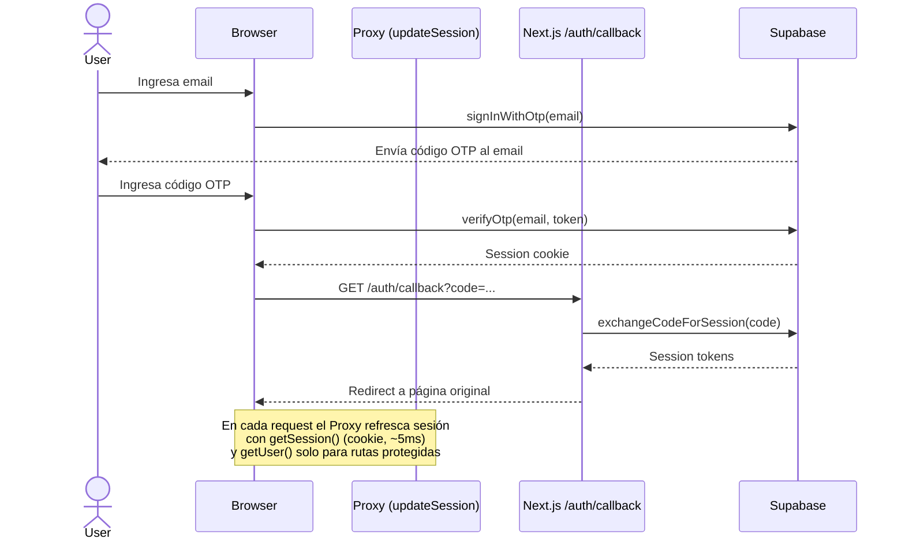
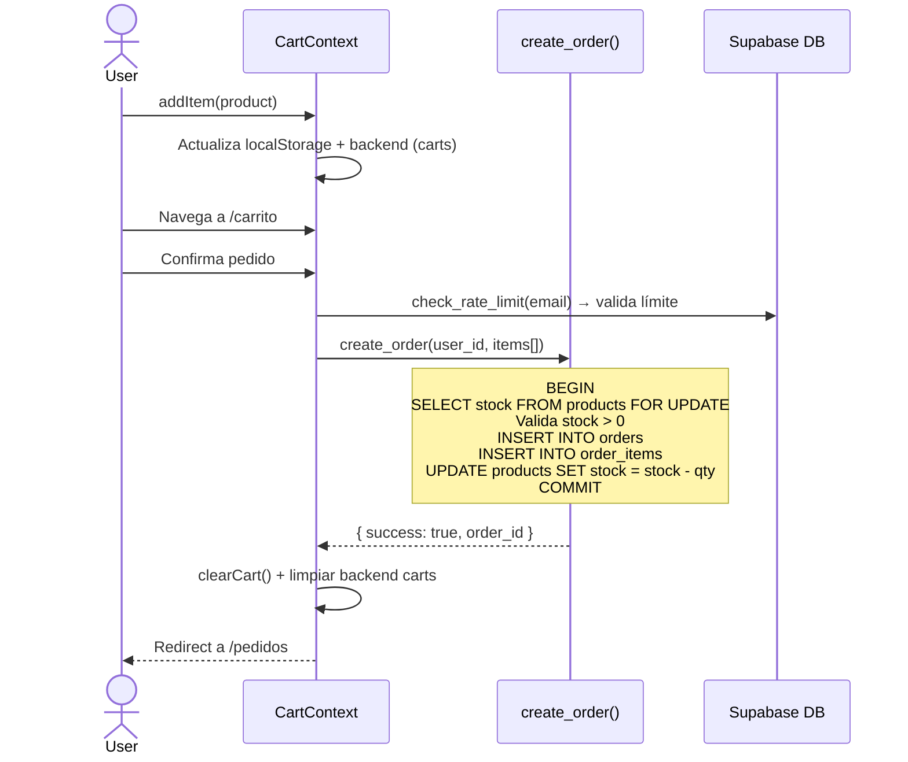

# Documentación del Proyecto

E-commerce de repuestos de autos construido con **Next.js 16**, **Supabase**, **Tailwind CSS v4** y **React 19**.

---

## 1. Descripción General

Es una aplicación web de comercio electrónico especializada en la venta de repuestos automotrices. Permite a los clientes navegar un catálogo de productos, filtrar por categoría/marca/modelo de auto, agregar productos al carrito y realizar pedidos mediante autenticación por OTP (código de un solo uso por email). Incluye un panel de administración para gestionar productos, pedidos, marcas, modelos, categorías y banners promocionales.

### Stack Tecnológico

| Capa        | Tecnología                                          |
|-------------|-----------------------------------------------------|
| Framework   | Next.js 16.2.9 (App Router)                         |
| Frontend    | React 19.2.4, Tailwind CSS v4, shadcn/ui            |
| Backend     | Supabase (PostgreSQL, Auth, Storage, RLS)           |
| Lenguaje    | TypeScript 5                                        |
| Autenticación | Supabase Auth + OTP + @supabase/ssr               |
| Estado      | React Context (carrito, usuario)                    |
| UI/Iconos   | Lucide React, sonner (toasts)                       |

---

## 2. Estructura del Proyecto

```
cod-space/
├── .agents/
│   └── skills/
│       ├── supabase/
│       └── supabase-postgres-best-practices/
├── public/
│   ├── favicon.ico                       # Favicon multi-resolución (16×16, 32×32, 48×48)
│   ├── favicon.svg                       # Favicon vectorial principal
│   └── images/
│       ├── logo-vector-full.svg          # Logo vectorial (7 colores, 180KB, fondo transparente)
│       ├── logo-vector2.svg              # Logo vectorial (3 colores, 115KB)
│       ├── logo-vector3.svg              # Logo vectorial (5 colores, 177KB)
│       ├── logo-full.png                 # Exportación PNG 5042×3600 a 300 DPI
│       └── logo.jpeg                     # Original raster
├── scripts/
├── src/
│   ├── app/
│   │   ├── admin/
│   │   │   ├── loading.tsx               # Estado de carga del dashboard admin
│   │   │   ├── page.tsx                  # Dashboard admin
│   │   │   ├── layout.tsx                # Layout admin con sidebar
│   │   │   ├── banners/page.tsx
│   │   │   ├── categorias/page.tsx
│   │   │   ├── marcas/page.tsx
│   │   │   ├── modelos/page.tsx
│   │   │   ├── pedidos/
│   │   │   │   ├── page.tsx
│   │   │   │   └── [id]/page.tsx
│   │   │   ├── productos/
│   │   │   │   ├── page.tsx
│   │   │   │   ├── carga-masiva/page.tsx  # Importación masiva desde Google Sheets
│   │   │   │   └── imagenes/page.tsx      # Asignación de imágenes a productos
│   │   │   └── usuarios/page.tsx
│   │   ├── api/
│   │   │   └── upload-image-from-url/
│   │   │       └── route.ts              # Proxy para descargar imágenes de URLs externas
│   │   ├── auth/
│   │   │   ├── callback/route.ts         # Manejador OAuth callback
│   │   │   └── login/page.tsx            # Login OTP
│   │   ├── carrito/
│   │   │   ├── loading.tsx               # Estado de carga del carrito
│   │   │   └── page.tsx                  # Página del carrito
│   │   ├── catalogo/
│   │   │   ├── loading.tsx               # Estado de carga del catálogo
│   │   │   ├── page.tsx                  # Catálogo con filtros y paginación por cursor
│   │   │   └── [id]/
│   │   │       ├── loading.tsx           # Estado de carga del detalle
│   │   │       └── page.tsx              # Detalle de producto
│   │   ├── pedidos/
│   │   │   ├── loading.tsx               # Estado de carga de pedidos
│   │   │   └── page.tsx                  # Historial de pedidos
│   │   ├── perfil/
│   │   │   ├── loading.tsx               # Estado de carga del perfil
│   │   │   └── page.tsx                  # Perfil de usuario
│   │   ├── privacidad/page.tsx           # Política de privacidad
│   │   ├── layout.tsx                    # Layout raíz (ThemeProvider, metadata, favicon)
│   │   └── page.tsx                      # Homepage con ISR (3600s)
│   ├── components/
│   │   ├── admin/
│   │   │   ├── banner-form.tsx
│   │   │   ├── banner-form-wrapper.tsx
│   │   │   ├── batch-image-uploader.tsx  # Asignación individual de imágenes por archivo/URL
│   │   │   ├── brand-form.tsx
│   │   │   ├── brand-form-wrapper.tsx
│   │   │   ├── bulk-upload-products.tsx   # Importación masiva desde Google Sheets CSV
│   │   │   ├── car-model-form.tsx
│   │   │   ├── car-model-form-wrapper.tsx
│   │   │   ├── car-model-brand-filter.tsx
│   │   │   ├── category-form.tsx
│   │   │   ├── category-form-wrapper.tsx
│   │   │   ├── confirm-dialog.tsx
│   │   │   ├── delete-banner-button.tsx
│   │   │   ├── delete-brand-button.tsx
│   │   │   ├── delete-car-model-button.tsx
│   │   │   ├── delete-category-button.tsx
│   │   │   ├── delete-product-button.tsx
│   │   │   ├── image-upload.tsx          # Subida con conversión a WebP (80% calidad)
│   │   │   ├── order-filters.tsx
│   │   │   ├── order-notifier.tsx        # Notificaciones en tiempo real de pedidos
│   │   │   ├── order-status-form.tsx
│   │   │   ├── product-filters.tsx
│   │   │   ├── product-form.tsx
│   │   │   ├── product-form-wrapper.tsx
│   │   │   ├── toggle-featured-button.tsx
│   │   │   ├── user-access-history.tsx
│   │   │   └── user-role-toggle.tsx
│   │   ├── ui/                           # Componentes shadcn/ui
│   │   │   ├── badge.tsx
│   │   │   ├── button.tsx
│   │   │   ├── card.tsx
│   │   │   ├── checkbox.tsx
│   │   │   ├── dialog.tsx
│   │   │   ├── input.tsx
│   │   │   ├── label.tsx
│   │   │   ├── select.tsx
│   │   │   ├── separator.tsx
│   │   │   ├── sheet.tsx
│   │   │   ├── sonner.tsx
│   │   │   └── textarea.tsx
│   │   ├── add-to-cart-button.tsx
│   │   ├── banner-carousel.tsx
│   │   ├── brand-showcase.tsx
│   │   ├── catalogo-filters.tsx
│   │   ├── navbar.tsx                    # Logo vectorial + theme toggle
│   │   ├── orders-tabs.tsx
│   │   ├── pagination.tsx                # Paginación por cursor (Anterior/Siguiente)
│   │   ├── product-card.tsx
│   │   ├── product-card-wrapper.tsx
│   │   ├── social-links.tsx
│   │   ├── theme-provider.tsx            # ThemeProvider con attribute="class"
│   │   └── theme-toggle.tsx              # Toggle claro/oscuro
│   ├── contexts/
│   │   ├── cart-context.tsx              # Carrito con persistencia backend + localStorage
│   │   └── user-context.tsx
│   ├── lib/
│   │   ├── supabase/
│   │   │   ├── admin.ts                  # Cliente con service_role (server-side)
│   │   │   ├── client.ts                # Cliente Supabase (navegador)
│   │   │   ├── middleware.ts            # updateSession() compartido
│   │   │   └── server.ts                # Cliente Supabase (servidor)
│   │   ├── data-cache.ts                # React cache() para categorías, marcas, modelos, banners
│   │   ├── types.ts                     # Tipos TypeScript
│   │   ├── utils.ts                     # Utilidades (cn)
│   │   └── validations.ts              # Schemas Zod para formularios
│   └── proxy.ts                         # Middleware Next.js (updateSession)
├── supabase/
│   ├── migration.sql                    # Tablas core
│   ├── migration_admin.sql              # Perfiles, roles, triggers, RLS
│   ├── migration_banners.sql            # Banners promocionales
│   ├── migration_brands_models.sql      # Marcas y modelos (many-to-many)
│   ├── migration_carts.sql              # Tabla carts para persistencia del carrito
│   ├── migration_create_order.sql       # Función RPC create_order() atómica
│   ├── migration_featured.sql           # Productos destacados
│   ├── migration_fulltext.sql           # Columna search_vector + índice GIN
│   ├── migration_profile.sql            # Perfiles extendidos + RLS
│   ├── migration_rate_limits.sql        # Rate limiting para login OTP
│   ├── migration_realtime.sql           # Publicación Realtime para pedidos
│   ├── migration_stock.sql              # Función decrement_stock
│   ├── migration_storage.sql            # Bucket de almacenamiento
│   └── seed.sql                         # Datos de prueba
├── next.config.ts
├── postcss.config.mjs
├── eslint.config.mjs
├── tsconfig.json
├── components.json                      # Configuración shadcn/ui
├── package.json
└── DOCUMENTACION.md                     # Este archivo
```

---

## 3. Diagrama de Arquitectura

```mermaid
graph TB
    subgraph Cliente
        Navbar[Navbar + ThemeToggle]
        Pages[Páginas]
        Contexts[Contextos: Cart, User]
        UI[Componentes UI: shadcn/ui]
    end

    subgraph "Next.js 16"
        ServerComponents[Server Components + ISR]
        ClientComponents[Client Components]
        Proxy[Proxy: updateSession con cookies]
        RouteHandlers[Route Handlers]
        CachedData[React cache(): brands, categories, etc.]
    end

    subgraph Supabase
        Auth[Supabase Auth]
        DB[PostgreSQL + pgvector + Realtime]
        Storage[Storage: images (WebP)]
        RLS[Row Level Security]
        RPC[Funciones RPC: create_order, check_rate_limit]
    end

    Cliente --> ServerComponents
    Cliente --> ClientComponents
    ClientComponents --> Contexts
    ClientComponents --> UI

    ServerComponents -->|createClient| DB
    ServerComponents -->|createClient| Auth
    ServerComponents --> CachedData
    Proxy -->|createServerClient + getSession| Auth
    RouteHandlers -->|exchangeCodeForSession| Auth

    ClientComponents -->|createBrowserClient| Auth
    ClientComponents -->|createBrowserClient| DB
    ClientComponents -->|createBrowserClient| Storage
    ClientComponents -->|createBrowserClient| RPC

    DB --> RLS
    Auth --> RLS
    RPC --> DB

    subgraph Base de Datos
        products[products]
        categories[categories]
        brands[brands]
        car_models[car_models]
        product_brands[product_brands]
        product_car_models[product_car_models]
        orders[orders]
        order_items[order_items]
        profiles[profiles]
        banners[banners]
        access_logs[access_logs]
        carts[carts]
        rate_limits[rate_limits]
    end
```

### Diagrama de Flujo de Autenticación



### Diagrama de Flujo de Compra



---

## 4. Modelo de Datos

### Tablas Principales

| Tabla               | Descripción                                      |
|----------------------|--------------------------------------------------|
| `categories`         | Categorías de productos (Motor, Frenos, etc.)    |
| `products`           | Productos con precio, stock, imagen, search_vector tsvector |
| `brands`             | Marcas de autopartes (Bosch, Brembo, etc.)       |
| `car_models`         | Modelos de auto vinculados a marca               |
| `product_brands`     | Relación many-to-many producto ↔ marca           |
| `product_car_models` | Relación many-to-many producto ↔ modelo auto     |
| `orders`             | Pedidos con estado y total                        |
| `order_items`        | Líneas de pedido (producto, cantidad, precio)     |
| `profiles`           | Perfiles de usuario con rol y dirección           |
| `banners`            | Banners del carrusel promocional                  |
| `access_logs`        | Registro de inicio de sesión                      |
| `carts`              | Carritos persistentes por usuario                 |
| `rate_limits`        | Control de intentos de login por email/ventana    |

### Funciones RPC

| Función              | Descripción                                      |
|----------------------|--------------------------------------------------|
| `create_order()`     | Crea pedido atómicamente: valida stock con `SELECT ... FOR UPDATE`, inserta orden e items, descuenta stock. Todo en una transacción. |
| `check_rate_limit()` | Verifica límite de intentos (5 por email cada 15 min). Inserta intento y retorna si puede continuar. |

### Seguridad (RLS)

- **is_admin()**: Función SQL SECURITY DEFINER que verifica rol `admin` en `profiles`.
- Políticas por tabla:
  - Lectura pública: `categories`, `products`, `brands`, `car_models`, `banners` (activos)
  - Lectura/escritura propia: `orders`, `order_items`, `profiles`, `carts`
  - CRUD admin: todas las tablas mediante `is_admin()`
  - Storage: bucket `images` público para lectura, admin para escritura
  - `carts`: solo lectura/escritura del propio usuario autenticado

---

## 5. Funcionalidades Implementadas

### Rendimiento y Optimización

1. **Paginación por cursor** -- Todas las listas (catálogo, productos admin, modelos, pedidos) usan paginación por cursor (`created_at|id` como base64url, `limit(PAGE_SIZE + 1)` para detectar "hay más"). Solo muestra "Anterior" / "Siguiente", sin números de página.
2. **Caché con React `cache()`** -- `src/lib/data-cache.ts` envuelve consultas a Supabase con `cache()` para categorías, marcas, nombres de marca, modelos de auto y banners activos.
3. **ISR (Incremental Static Regeneration)** -- Homepage se revalida cada 3600s, catálogo y detalle de producto cada 300s.
4. **Middlewares optimizados** -- `src/proxy.ts` usa `getSession()` (basado en cookies, ~5ms sin latencia de red) para rutas públicas y `getUser()` solo para rutas protegidas.
5. **Conversión a WebP** -- `image-upload.tsx` convierte imágenes a WebP (calidad 80%) antes de subir a Supabase Storage, reduciendo el tamaño ~60-70%.

### Seguridad

6. **Rate limiting en login OTP** -- Función RPC `check_rate_limit()` que permite máximo 5 intentos por email por ventana de 15 minutos.
7. **Creación de pedidos atómica** -- Función RPC `create_order()` que ejecuta toda la operación (validar stock, crear orden, descontar stock) en una sola transacción con `SELECT ... FOR UPDATE` para evitar condiciones de carrera.
8. **Validación Zod** -- Schemas de validación en `src/lib/validations.ts` para productos, categorías, marcas, modelos y banners.
9. **Persistencia de carrito en backend** -- Tabla `carts` con RLS que permite solo lectura/escritura del propio usuario. El carrito se sincroniza al iniciar sesión (merge localStorage + backend).

### UX y Funcionalidad

10. **Búsqueda full-text** -- Columna `search_vector` (tsvector con configuración de stemming español) e índice GIN para búsqueda eficiente vía Supabase `.textSearch()`.
11. **Estados de carga** -- Archivos `loading.tsx` en todas las rutas principales (admin, carrito, catálogo, detalle, pedidos, perfil) para mostrar feedback visual durante la navegación.
12. **Tema claro/oscuro** -- Theme toggle con `next-themes` y `attribute="class"`. Modo oscuro aplica clase `.dark` al `<html>`. El logo SVG tiene fondo transparente para funcionar en ambos modos.
13. **Notificaciones en tiempo real** -- `order-notifier.tsx` se suscribe a cambios en la tabla `orders` mediante Supabase Realtime y muestra un toast cuando llega un nuevo pedido.
14. **Importación masiva desde Google Sheets** -- Componente `bulk-upload-products.tsx` que lee hojas públicas de Google Sheets (export CSV, sin API key), valida filas, muestra previsualización con estado válido/error, e importa productos. Crea marcas y modelos automáticamente si no existen.
15. **Asignación de imágenes por lote** -- `batch-image-uploader.tsx` permite buscar productos sin imagen y asignarles una mediante subida de archivo (con conversión a WebP) o pegando una URL pública.
16. **Logo vectorial + favicon** -- Logo convertido de JPEG a SVG vectorial (sin fondo) mediante Inkscape, favicon SVG como primario y `.ico` multi-resolución como fallback. El logo se renderiza con `<Image unoptimized>` para evitar distorsión de tamaño.
17. **Proxy de descarga de imágenes** -- API route `/api/upload-image-from-url` que descarga imágenes de URLs externas y las retorna como blob, evitando problemas de CORS al importar imágenes de proveedores.

### Código y Mantenibilidad

18. **Migraciones SQL versionadas** -- Las migraciones están separadas por funcionalidad (carts, create_order, fulltext, rate_limits, realtime) aunque no usan el sistema oficial de Supabase CLI.
19. **Cliente admin** -- `src/lib/supabase/admin.ts` proporciona un cliente con `service_role` para operaciones server-side que requieren bypass de RLS (ej: subida de imágenes durante importación masiva usando la API route).

---

## 6. Puntos de Mejora Pendientes

### Rendimiento

1. **Consultas N+1 en ProductCard** -- `ProductCard` itera sobre `product_brands` y `product_car_models` que podrían tener relaciones anidadas. Verificar que las consultas usen joins eficientes (actualmente se resuelven en el server component pero podrían optimizarse).

### Seguridad

2. **Claves expuestas en frontend** -- `NEXT_PUBLIC_SUPABASE_ANON_KEY` es visible al cliente. RLS protege, pero cualquier error en las políticas expone datos.

### UX

3. **Vista mobile del dashboard admin** -- El layout admin no está optimizado para pantallas pequeñas (tablas sin scroll horizontal).
4. **El carrito no persiste sin sesión** -- Sin estar autenticado, el carrito solo existe en localStorage y se pierde al cambiar de navegador/dispositivo.

### Código

5. **Wrapper components innecesarios** -- `ProductCardWrapper`, `CategoryFormWrapper`, etc. existen solo para evitar `"use client"`. Se podría usar `server-only` o reestructurar.
6. **Sin tests** -- No hay tests unitarios ni de integración.
7. **Sin manejo de errores global** -- No hay un `error.tsx` global. Los errores no capturados muestran la pantalla de error por defecto de Next.js.
8. **Sin monitoreo de rendimiento** -- No hay analytics ni monitoreo de BD.

### Infraestructura

9. **Migraciones no versionadas oficialmente** -- Aunque están separadas por funcionalidad, no usan `supabase migration new`.
10. **Sin CI/CD** -- No hay pipelines de integración continua.

---

## 7. Referencias

- **Supabase Project Ref**: `zmleythqmafzfvomwjfy`
- **Inkscape**: Instalado en `/mnt/c/Program Files/Inkscape/bin/inkscape.exe` (conversión de logo)
- **Chrome**: `/mnt/c/Program Files/Google/Chrome/Application/chrome.exe`
- **Turbopack**: El servidor de desarrollo (`next dev`) falla en Windows con error de lectura en `D:\github\cod-space\nul` (nombre de dispositivo reservado). El build de producción funciona correctamente.
